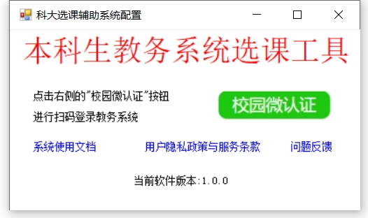
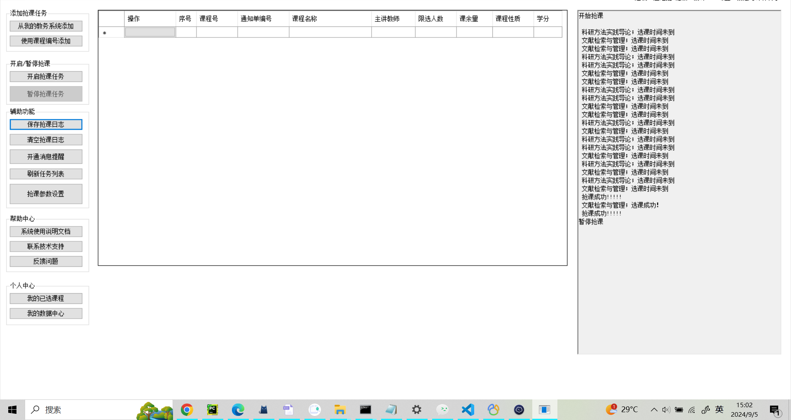
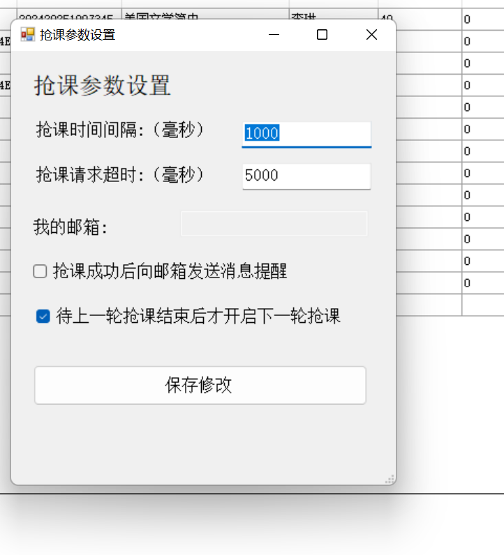
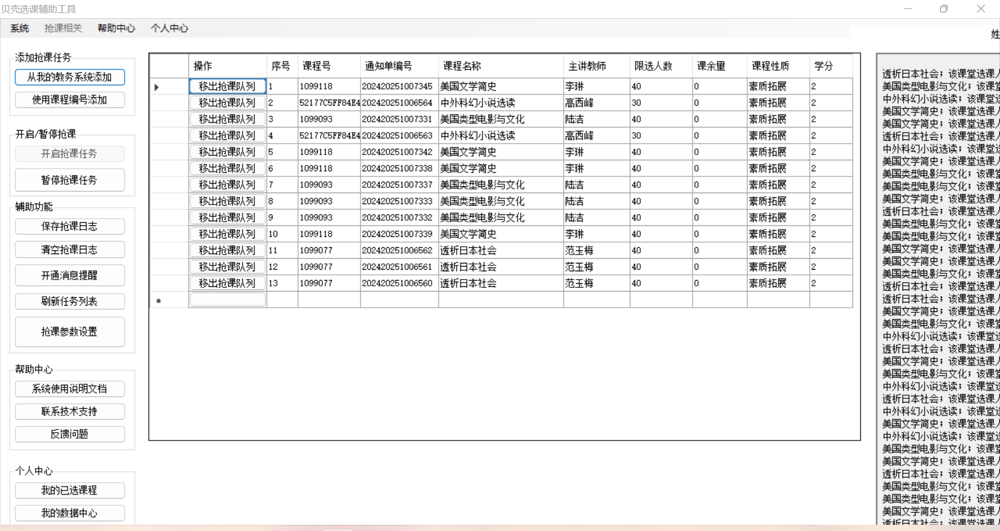
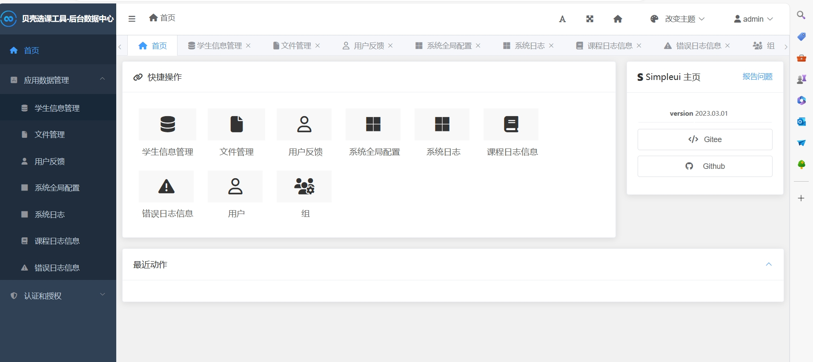

***
<div align="center">
  
  <h1>🌟 ustb-jwgl-manager 🌟</h1>
  <p>贝壳选课辅助工具</p>
</div>

## 🌟 简介

本项目是专为解决小贝壳们选课难题而研发的选课辅助工具，代码完全开源，供大家参考学习

### 特点

+ 已打包为exe可执行文件，开箱即用！**不会代码也能使用**
+ 使用微信扫码授权实现教务系统登录，操作更安全便捷！
+ 可视化操作，添加课程更简单！
+ 日志记录，抢课日志不丢失！
+ 邮箱消息提醒，抢课更省心！
+ 程序参数可控，定制你的抢课方案！

### 实现功能

+ 微信扫码授权教务登录
+ 可视化添加课程，进入抢课队列
+ 自定义时间间隔等参数
+ 提供邮箱提醒，抢课成功后发送邮箱消息
+ 日志本地持久化存储
+ 更多功能，等你去探索...

### 历史沿革

+ 2024年下半学期，继续更新维护
+ 2024年上半学期，增加微信扫码登录，无需手动输入cookies
+ 2023年下半学期，使用 `C#` 窗体实现可视化，不会代码的同学也能使用
+ 2023年上半学期，升级此爬虫脚本，用于抢素质拓展课
+ 2022年下半学期，为了解决抢不到体育课的难题，开发了第一代 `python` 选课脚本，彻底颠覆了手动抢不到课的难题

## 🌟 技术选型

+ 后端使用 `python` 的 `Django` web开发框架，处理与教务系统之间的交互
+ 客户端使用 `C#` ，与传统的web前端相比，`C#` 的高性能与支持多线程更适用于此场景

## 🌟 快速开始

首先需要clone此项目

### 启动后端服务i

进入后端项目路径

```t
cd backend
```

第一次运行需要

```text
# 安装依赖
pip install -r requirements.txt
# 迁移数据表结构
python manage.py makemigrations
python manage.py migrate
# 创建缓存表
python manage.py createcachetable
# 收集静态文件
python manage.py collectappstatic
# 创建超级管理员账户，用户登录管理后台
python manage.py createsuperuser
```

启动后端服务

```text
python manage.py runserver

```

### 运行客户端

确保你的 `Visual Studio` 安装了 C#桌面开发 环境

使用 `Visual Studio` 打开 `frontend/JwglqProMax-Frontend.sln`

**注意**，这里使用了一些 `NuGet Packages` 第三方库，需要在 `Visual Studio` 中安装，安装之后运行即可启动

## ⚠ 重要说明

**⚠此开源程序仅用于技术交流学习，请不要用于商业用途，不需要的课程请及时退课，禁止恶意出售课程牟利**

**⚠请合理设置选课时间间隔，不要给教务系统造成过多的压力**

## 🌟 效果预览







## 🌟 获取帮助

```text
@Author ;@我不是大佬
@Email  ;2869210303@qq.com
@Qq     ;2869210303
@wx     ;safeseaa
@github ;https://github.com/U202142209
@blog   ;https://blog.csdn.net/V123456789987654
``` 